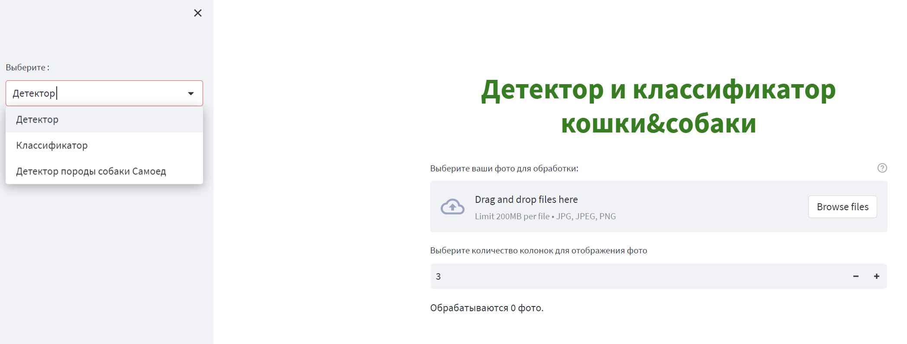

# Cat & Dog Detector using Streamlit by Nazym Shakirkhozha

Detector - YoloV8 (mAP50 99.5%) and Classificator - EfficientNet (accuracy 99.7%). 

Данный код позволяет определять на фото кот или собака. 

Как бонус к этой задаче определяет породу собаки Самоед (accuracy 92%). 

• в качестве входных данных использовались Kaggle соревнования

https://www.kaggle.com/datasets/andrewmvd/dog-and-cat-detection

и 
https://www.kaggle.com/datasets/zippyz/cats-and-dogs-breeds-classification-oxford-dataset  
(для определения породы собаки Самоед);

• количество распознаваемых классов – 2 (кошки и собаки)

## Documentation 

[Ссылка на YoloV8](https://github.com/ultralytics/ultralytics)

  1. Обоснование выбора модели по детекции

Faster R-CNN: Faster R-CNN — это популярная архитектура обнаружения 
объектов, которая является быстрой и точной. 

Он имеет высокую точность и способен обнаруживать объекты в режиме реального времени.

YOLO: YOLO — это одноэтапная архитектура обнаружения объектов, которая работает быстро и точно. 

Он имеет высокую точность и способен обнаруживать объекты в режиме реального времени.

SSD: SSD — это быстродействующая и точная архитектура однократного обнаружения объектов. 

Он имеет высокую точность и способен обнаруживать объекты в режиме реального времени.

Минусы:

Faster R-CNN. Более быстрый R-CNN требует больше вычислительных ресурсов, 

чем другие архитектуры, что делает его более дорогим для развертывания в производстве.

YOLO: YOLO имеет более низкий уровень точности, чем другие архитектуры, 

что делает его менее надежным для производственного использования.

SSD: SSD требует больше вычислительных ресурсов, чем другие архитектуры, 

что делает его более дорогим для развертывания в рабочей среде.

В данном проекте был выбран YoloV8 потому что он показал хорошие результаты 

на наших данных и данная архитектура  вышла месяц назад (January 10th, 2023).

Плюсы YOLOv8:

    1. Повышенная точность: YOLOv8 имеет улучшенную точность 
    по сравнению с предыдущими версиями, с mAP до 57,9% в 
    наборе данных COCO.

    2. Более быстрое время вывода: YOLOv8 быстрее,
    чем предыдущие версии, со временем вывода 
    до 33 мс на изображение.

    3. Улучшенная архитектура: YOLOv8 имеет новую архитектуру, 
    более эффективную и точную, чем предыдущие версии.

Конкретные улучшения в архитектуре YOLOv8 по сравнению с YOLOv7:

    1. Частичные межэтапные соединения (CSP): 
    CSP — это новая функция в YOLOv8, которая позволяет улучшить 
    повторное использование функций и повысить точность.

    2. Увеличение данных Mosaic. Увеличение данных Mosaic — это 
    новый метод, используемый в YOLOv8, который помогает повысить 
    точность за счет случайного объединения нескольких изображений 
    в одно обучающее изображение.

    3. Регуляризация DropBlock. Регуляризация DropBlock — это 
    новый метод, используемый в YOLOv8, который помогает 
    уменьшить переобучение путем случайного отбрасывания 
    блоков нейронов во время обучения.

    4. Функция активации Mish: Mish — это новая функция активации, 
    используемая в YOLOv8, которая помогает повысить точность,
    обеспечивая лучший градиентный поток и более быструю сходимость.

2. Обоснование выбора модели по классификации

[Ссылка на натренированные модели по классификации на PyTorch](https://pytorch.org/vision/stable/models.html)

В классификации предварительно обученная модель была использована. 
Плюсы:
- Предварительно обученные CNN уже обучены на больших наборах данных, поэтому их можно использовать для быстрой классификации изображений с высокой точностью.
- Предварительно обученные CNN более эффективны, чем обучение модели с нуля, поскольку для их обучения требуется меньше данных и времени.
- Предварительно обученные CNN можно использовать для трансферного обучения, что позволяет точно настроить модель для конкретной задачи.

Минусы:
- Предварительно обученные CNN не всегда являются лучшим выбором для каждой задачи, поскольку они могут быть не в состоянии точно классифицировать изображения, которые значительно отличаются от набора данных, на котором они были обучены.

EfficientNet — это архитектура классификации изображений, которая лучше подходит для производства по сравнению с другими архитектурами благодаря своей превосходной производительности и эффективности. Он спроектирован так, чтобы быть более эффективным, чем другие архитектуры, за счет использования комбинации разделяемых по глубине сверток, блоков сжатия и возбуждения и нового метода сложного масштабирования. Это позволяет достичь более высокой точности с меньшим количеством параметров и FLOPS, чем другие архитектуры. Кроме того, он оптимизирован для мобильных и периферийных устройств, что делает его идеальным для производственных приложений.

Из предварительно обученных моделей по таблице выбор стоял между семейством моделей MobileNet и EfficientNet. 	
Acc@1 показывает входит ли наш класс в топ 1 по процентажу предсказываний, а 	
Acc@5 есть ли наш настоящий класс в топ 5 по процентажу предсказываний. На новых данных модель быстрее предсказывает если весит поменьше. В этом плане оба семейства моделей подходят. Второй показал на валидационной выборке несколько процентов выше в точности. 

Для детекции XML формат был переделан под YoloV8.
Для классификации были созданы новые папки где название классов это название папки. Данные были разделены на три выборки (80%/10%/10%) и по тестовой выборке модели показали следующие результаты:
Cat or Dog Detector - YoloV8 (mAP50 99.5%) 
Cat or Dog Classificator - EfficientNet (accuracy 99.7%).
Samoyed Classificator - EfficientNet (accuracy 92%).

Процесс обучения классификационных моделей:

Процесс обучения детектор моделей:

Сonfusion matrix:

Модели по классификации и по детекции показывают умеренную устойчивость к шуму так как были натренированы с использованием аугментации данных. Модели на новых данных предсказывают в среднем меньше чем 60 милисекунд.
## Installation

  1. Установить окружение conda (Anaconda)
  2. `conda create -n yolo8 python=3.10`
  3. cd путь к папке cats_dogs
  4. `conda activate yolo8`
  5. `pip3 install -U -r requirements.txt`
  4. `cd streamlit_app`
  5. `streamlit run main.py`

После должен открыться браузер по адресу: 
http://localhost:8501

## Build with Docker

  1. Установить Docker и Docker-compose
  2. `docker compose up --build`

Откройте браузер по адресу: 
http://localhost:8501

## Import and run docker image

    1. zcat catdog.gz | docker import - naz

    2. docker run -i -e BASH_ENV="~/.bashrc" -p 8501:8501 
        -w=/home/ubuntu/CATS_DOGS/streamlit_app 
        --entrypoint "/bin/bash" naz -c 'streamlit run main.py'

Откройте браузер по адресу: 

http://localhost:8501
## Usage/Examples

Если все этапы были выполнены правильно то в браузере должно открыться окно со
следующими полями:
Выбор модели слева и поле для прикрепления фото. 

Пример работы первой модели для детекции. Снизу фото отображается класс и  процент вероятности принадлежности данному классу.

Если хотите новые фото проверить на модели пожалуйста почистите старые фото через крестики или обновите страницу.
